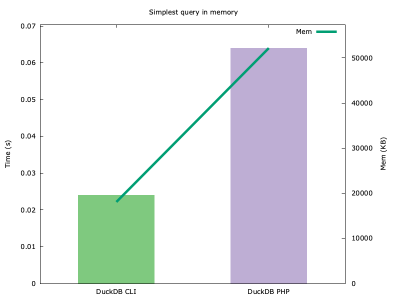
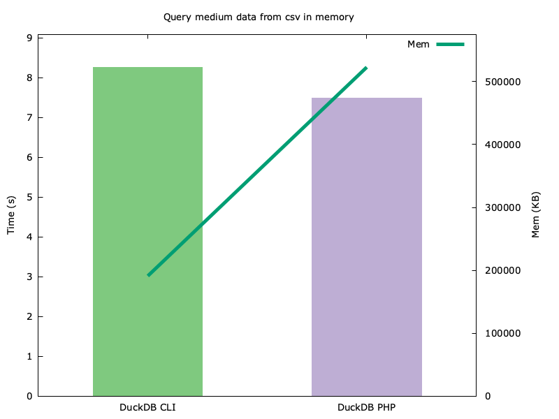
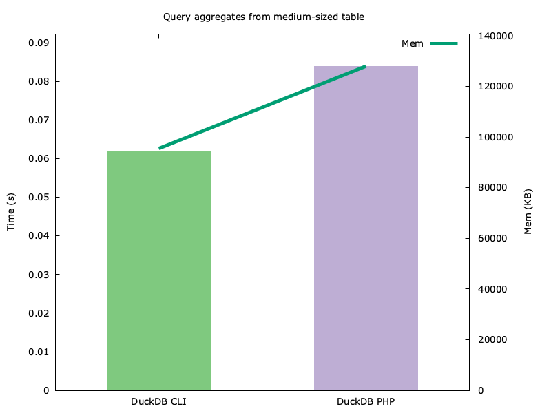
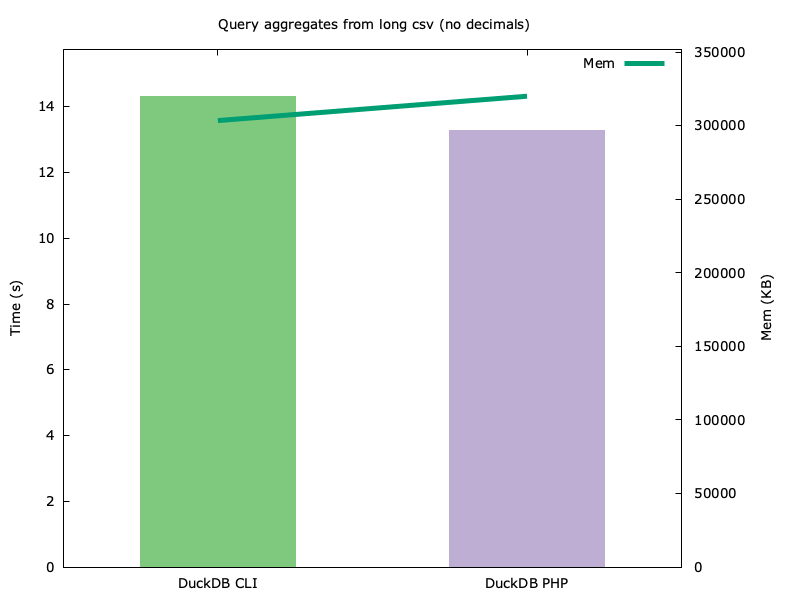
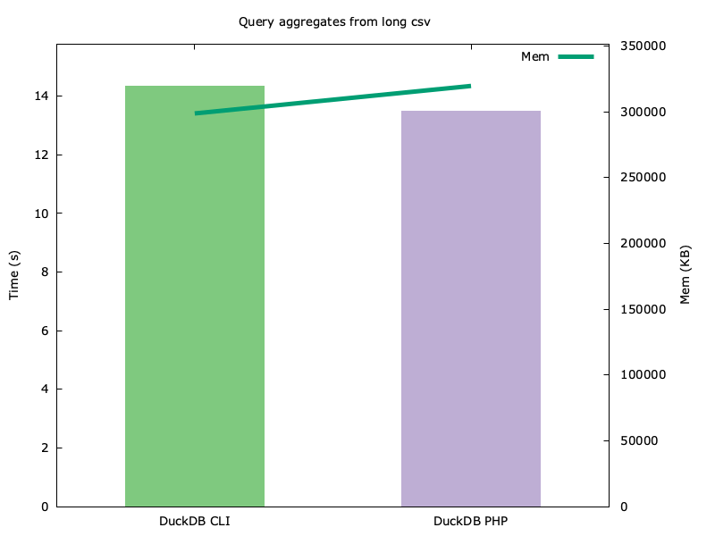
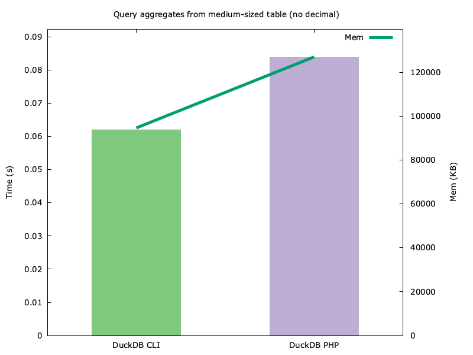
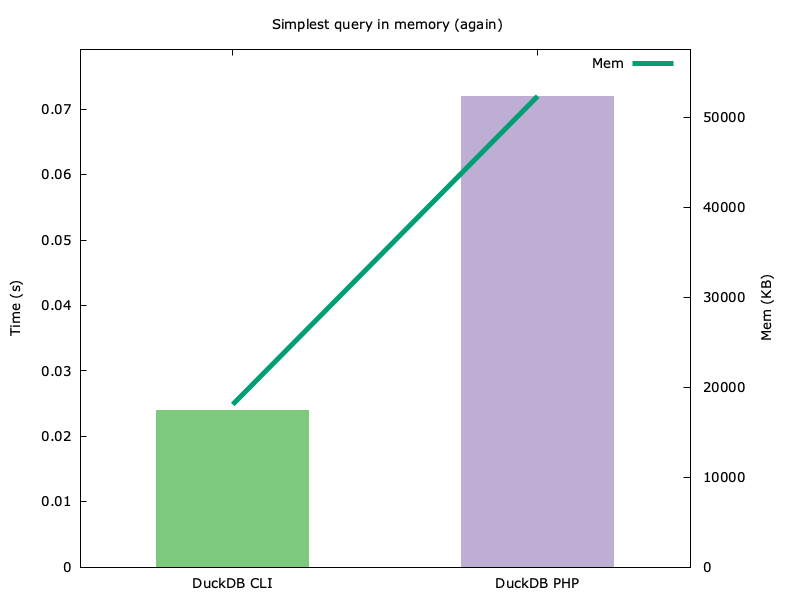
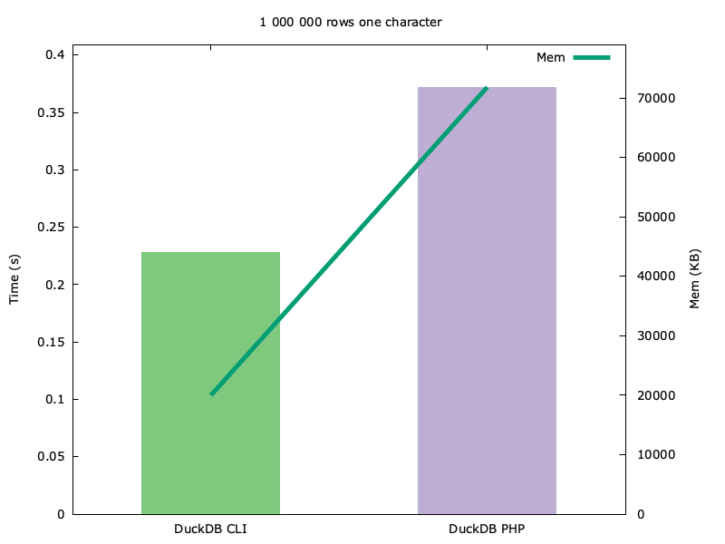

# Benchmarking Results

Below are the results obtained on a local machine with the following hardware:

```
    Hardware Overview:

      Model Name: MacBook Pro
      Model Identifier: Mac15,7
      Model Number: MRW13Y/A
      Chip: Apple M3 Pro
      Total Number of Cores: 12 (6 performance and 6 efficiency)
      Memory: 18 GB
      System Firmware Version: 11881.81.4
      OS Loader Version: 11881.81.4
```

These results were generated using the following command:

```shell
GENERATE_PLOTS=1 test/Performance/compare_current_branch_performance.sh test/_data/test_file_queries.sql
```

I am aware that this Bash script is not the most optimal way to collect metrics, but it is highly useful for an important process: checking for potential performance degradation after changes.

Although it is not the script's primary purpose, I added a comparison with the DuckDB CLI official client as a reference. The results shown here reflect this comparison.

## Key Considerations

- Most of the benchmarking focuses on query performance, which makes sense in most cases. However, here we are using the DuckDB C API for querying. This means that the performance of this part is entirely dependent on the C API's performance. While there could be some overhead due to the context switching between PHP and C for the query, this overhead is either negligible or nonexistent.

- If querying is not a performance concern, what is? The bottleneck is clearly type conversion. The DuckDB C API returns custom types with different structs, which need to be converted to PHP types, either as scalars or custom classes. This conversion introduces unavoidable overhead, and I have focused on improving performance and reducing the time spent on this process.

- Since querying is not an issue but reading the results is, we cannot simply run the query and print the results. Both the DuckDB CLI and the PHP script `test/Performance/duckdb_api_batches` are configured to print the full result in a similar manner.

- As shown in the graphs, queries with a small number of fields in the results perform as well as in the DuckDB CLI tool, even if the query itself is resource-intensive. Aggregates over large datasets are a good example: the query itself requires intensive resource usage, but it takes almost the same amount of time in both PHP and the CLI. Since the results are just aggregates, there is no overhead for reading them. For such queries, the DuckDB CLI and the PHP library have similar performance in terms of execution time.

- On the other hand, a drop in performance is observed for queries that return large result sets, even if the query itself is not complex and executes quickly.

- You may notice that memory consumption is higher for the PHP library. My assumption is that the DuckDB CLI streams the results, whereas the PHP library cannot use streamed results because the DuckDB API only provides the [`duckdb_query`](https://duckdb.org/docs/stable/clients/c/api#duckdb_query) function. This function "stores the full (materialized) result in the out_result pointer." Since this limitation cannot be addressed unless new methods are added to the C API, I am not concerned about this for now.

## Graphs

Below are the performance graphs:












